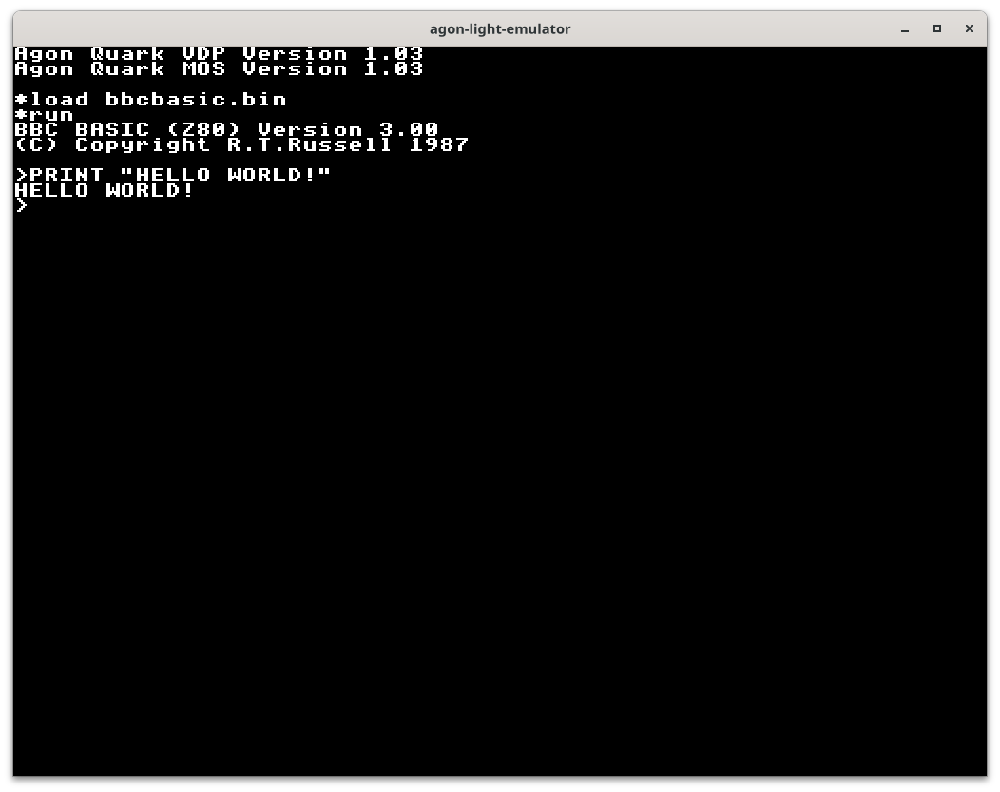

# agon-light-emulator

This *will be* an emulator for the agon light (https://www.thebyteattic.com/p/agon.html) by Bernardo Kastrup.

The ez80 emulation is done by tomm (https://github.com/tomm/agon-cpu-emulator).

The VDP emulation is now a crate (https://github.com/astralaster/agon-light-vdp)

The original firmware for the agon light is done by Dean Belfield (https://github.com/breakintoprogram).



## ElectronOS update

I have very rudily commented out MOS features and added ElectronOS features to aid in debugging my programs for the Agon. Maybe a future release allows switching between EZ80 kernels like MOS versions and others like ElectronOS.

## How to build

```shell
cargo build
```

## How to run

```shell
cargo run
```

## Missing features
* Complete keyboard support.
* Color Redefinition
